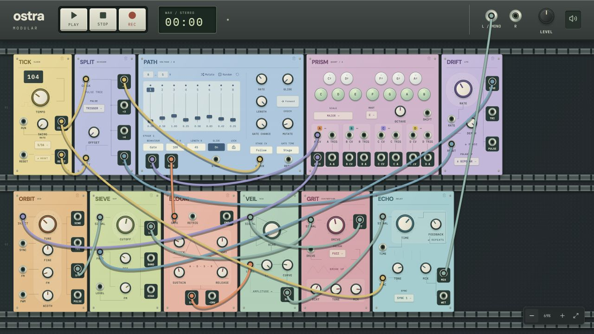

<div align="center">

# ostra

**A modular playground for your browser.**

Patch a melody. Make it wander. Build the instrument you wish existed.

[Get started](#get-started) · [Explore the modules](docs/studio-modules.md) · [Build a module](docs/modules.md) · [Contribute](CONTRIBUTING.md)

</div>



ostra is a local-first modular synthesizer with **25 instruments and utilities plus a fixed stereo master**, tactile controls and an open canvas. Connect audio, control voltages and gates to make anything from a single voice to a self-playing patch. Everything runs on your machine—no accounts, API keys or audio backend.

> **Experimental alpha.** Ready to explore and contribute to; expect the occasional rough edge.

## Why ostra?

- **A rack you can get lost in.** Colourful, individually designed faceplates, draggable modules and patch cables that fade out of the way while you work.
- **More than note sequencing.** Sequence arbitrary voltages, quantise four voices to a shared scale, route signals, delay CV and build feedback loops.
- **A useful palette from the first patch.** Oscillators, envelopes, filters, VCAs, random sources, granular sampling, tape delay, distortion and reverb.
- **Record a take.** Physical transport buttons, fixed L/R output jacks and a master level knob. Finish recording to download a stereo WAV directly to your device.
- **Bring your own sounds.** Drop a WAV or MP3 onto GRAIN. Decode, play and store it locally.
- **Pick up where you left off.** Rack, settings and cables save automatically. Refresh returns to your patch with audio paused.
- **Make your own modules.** One folder contains a module's definition, React panel and audio processor. Shared knobs, switches and jacks handle the familiar parts.

## Get started

Requires **Node.js 22+** and npm.

```sh
git clone https://github.com/NickTikhonov/ostra.git
cd ostra
npm ci
npm run dev
```

Open **http://127.0.0.1:3000**. A connected starter rack is ready for your first visit. Press **Play** in the top bar when you want to hear it.

| Gesture                         | What it does                                        |
| ------------------------------- | --------------------------------------------------- |
| Click empty space, or press `A` | Search and add a module                             |
| Drag a module's title           | Move it; nearby modules snap together               |
| Drag between jacks              | Patch an output into an input                       |
| Click a connected jack          | Reconnect its cable; `Shift` starts another cable   |
| Right-click a jack or cable     | Unplug it                                           |
| Drag a knob up/down             | Change its value; hold `Shift` for fine control     |
| Hover a jack                    | Inspect its audio or CV voltage after a short delay |
| `⌘/Ctrl + Z`                    | Undo; add `Shift` to redo                           |

The [rack guide](docs/rack-guide.md) covers patching, persistence, samples and recovery in more detail.

## Inside the rack

| Make sound                          | Move it                                | Shape it                     | Connect it                               |
| ----------------------------------- | -------------------------------------- | ---------------------------- | ---------------------------------------- |
| **ORBIT** — VCO                     | **PATH** — 8-stage voltage sequencer   | **SIEVE** — filter           | **VEIL** — dual VCA                      |
| **GRAIN** — sampler / granular      | **PRISM** — four-channel quantiser     | **GRIT** — distortion        | **BRAID** — CV mixer / attenuverter      |
| **CHANCE** — random / sample & hold | **BLOOM** — voltage-controlled ADSR    | **ECHO** — delay             | **HARBOUR** — stereo mixer / sends       |
|                                     | **DRIFT** — LFO                        | **SPOOL** — tape-style delay | **JUNCTION** — voltage-controlled switch |
|                                     | **VECTOR** — dual function generator   | **HALO** — reverb / freeze   | **RELAY** — clocked CV delay             |
|                                     | **TICK** — clock · **SPLIT** — divider |                              | **LOGIC** — gates / comparator           |

**TINE** adds a pluck/bell/wood percussion voice; **PULSE** provides three independent Euclidean trigger tracks with a shared clock and concentric rhythm display. **SPROUT** adds two independent attack/decay envelopes, with trigger buttons and end-of-cycle outputs. **AMBER** ranges from gentle stereo warmth to heavy saturation, with a SCORCH boost and analog drive meter.

All jacks carry sample-rate voltages: the audio/CV labels are guides, not restrictions. Nine archived module types also remain available to existing saved racks. [Read the module guide →](docs/studio-modules.md)

## Build the missing module

Modules are small, self-contained source contributions:

```text
src/modules/your-module/
├── definition.js     Ports, parameters, defaults and saved-data migrations
├── Panel.tsx         Your layout, built with shared React controls
├── processor.js      Sample-by-sample audio and CV processing
├── panel.module.css  Optional scoped styling
└── index.ts          Connects the pieces
```

The development watcher discovers new module folders automatically. You can write a module by hand or work with a coding assistant—there is **no in-browser AI generation or publishing system yet**. That future direction is described in the [platform design notes](docs/module-platform-architecture.md).

Start with the [module contributor guide](docs/modules.md), which includes a complete attenuator example. Module contributions run as trusted application code; they are not sandboxed plugins.

## Under the hood

**React + Next.js** draw the rack. An **AudioWorklet** processes the signal graph independently of the interface, with parameter smoothing, explicit feedback delays and bounded speaker output. **localStorage** holds the patch; **IndexedDB** holds imported samples.

```sh
npm run format:check
npm run typecheck     # UI, every module processor and the audio host
npm test              # Silent DSP, persistence and recovery regressions
npm run build
npm start
```

The build produces a static `out/` directory. Serve it at the root of an HTTPS site; localhost works for development. There is no backend to deploy. Browser storage belongs to its origin, so moving between localhost and a hosted URL does not transfer your rack or samples.

## Contributing

New modules, thoughtful panel improvements, DSP fixes and small reproducible bug reports are welcome. Read [CONTRIBUTING.md](CONTRIBUTING.md) for the workflow and [AGENTS.md](AGENTS.md) for module design principles.

The panels and processors are original digital instruments inspired by modular synthesis, not circuit-accurate emulations or manufacturer-endorsed products. Third-party notices, including font licenses, are included in [the repository](public/THIRD_PARTY_NOTICES.txt) and every static build. **The project license is awaiting selection; no open-source license has been granted yet.**
